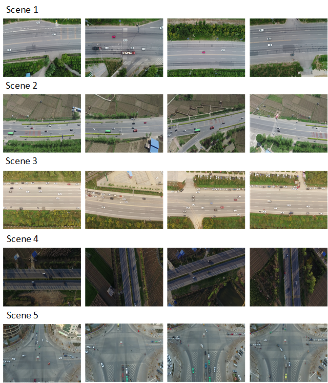
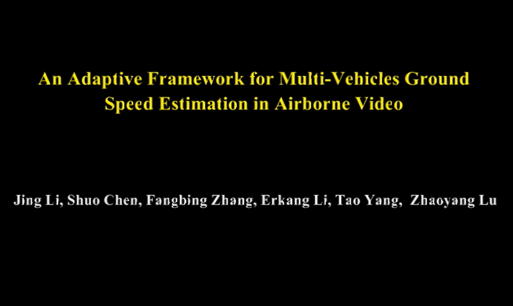

## Abstract

With the rapid development of unmanned aerial vehicle (UAV), UAV-based intelligent airborne surveillance system represented by real-time ground vehicle speed estimation has attracted wide attention from researchers. However, there are still many challenges in extracting speed information from UAV videos, including dynamic moving background , small target size, complicated environment and diverse scenes. In this paper, we propose a novel adaptive framework for multi-vehicle ground speed estimation in airborne videos. Firstly, we build a traffic dataset based on UAV. Then we use the deep learning detection algorithm to detect the vehicle in the UAV field of view, and obtain the  
trajectory in the image through the tracking-by-detection algorithm. Thereafter, we present a motion compensation method based on homography.  This method obtains matching feature points by optical flow method , and eliminates the influence of detected target to accurately calculate homography matrix to determine real motion trajectory in the current frame. Finally, vehicle speed is estimated based on mapping relationship between the pixel distance with the actual distance. The method regards the actual size of the car as prior information and adaptive recovers the pixel scale by estimating the vehicle size in the image, and then calculates the vehicle speed. In order to evaluate the performance of the proposed system, we carry out a large number of experiments on the AirSim Simulation platform and real UAV aerial surveillance experiments. Through quantitative analysis of the simulation results, as well as qualitative analysis 18 of real experiments, we verify that the proposed system has a unique ability to detect, track and estimate speed of ground vehicle simultaneously even with a single downward looking camera. Additional, the system can obtain effective and accurate speed estimation results even in various complex scenes. 

## Dataset

Dataset can be downloaded [here](https://pan.baidu.com/s/1Q9HXOt_k_wPsNkPPyLBssw). Total in size = 48.05G. Data was caputred 29frames/s, and the resolution of each frame is 1280*960. 

## Demo

Demo video for An Adaptive Framework for Multi-Vehicles Ground Speed Estimation in Airborne Videos can be download [here](https://youtu.be/OdH7ffg_egc).

