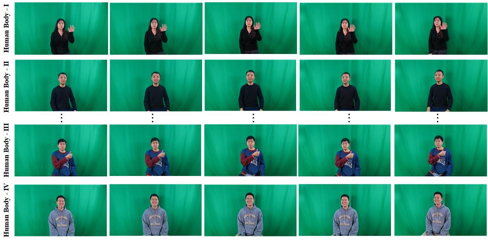
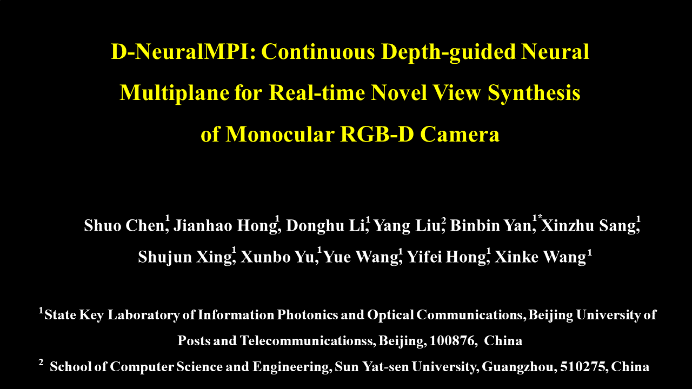

## Abstract

Single-camera real-time view synthesis is critical in the field of 3D video communication. Existing methods are hard to achieve continuous, real-time, high-quality free-viewpoint synthesis in temporal space. To address this problem, this paper proposes a continuous depth-guided neural multiplane network(D-NeuralMPI), including the depth clustering module, the initial multiplane images (MPIs) jump connection module, and the MPIs loss function. The core of this method is to introduce the depth image and process it through the above three modules so that the network can predict the accurate and stable scene geometry. Specifically, the depth clustering module gets the position of the spatial sampling point by spatially clustering the input depth image and fusing it with the encoded color image to the decoding network. Next, the initial MPIs jump connection module processes the input color image hierarchically according to the sampling point position to obtain initial MPIs, which are fused with the decoding model to predict the color and density of each plane separately. In addition, to enable the network to learn robust scene geometry and improve the quality of novel views, a novel MPIs loss function is proposed to guide the network learning. To evaluate our approach, we created an RGB-D multi-view dataset named BUPT-333-DATA, which is obtained by a multi-camera array composed of five Azure Kinect DKs to collect dynamic scene data synchronously in real-time. The proposed method outperforms state-of-the-art baselines for novel view synthesis and scene geometry estimation on the BUPT-333-DATA dataset. We also experimented on 3D light field displays and achieved good display results.

## Dataset

Dataset can be downloaded on Baidu Cloud Disk [here](https://pan.baidu.com/s/1ZPL2C_LJlbLL0Uf5H1A8ew),  Baidu Cloud extraction code：**6666**. Total in size = 23.5G. Data was caputred 30frames/s, and the resolution of each frame is 1280*720. 

## Demo

Demo video for D-NeuralMPI: Continuous Depth-guided Neural Multiplane for Real-time Novel View Synthesis of Monocular RGB-D Camera can be download on Baidu Cloud Disk [here](https://pan.baidu.com/s/14yprvWJlQh4Nf2tJyz4kvA), Baidu Cloud extraction code：**6666**.

